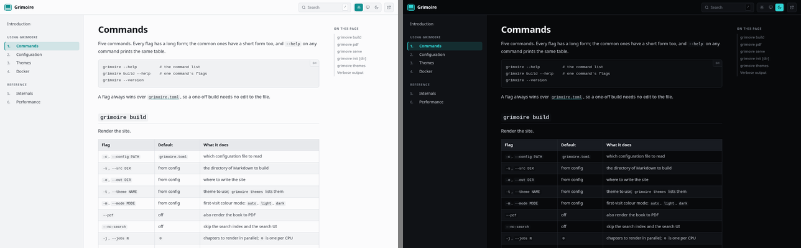
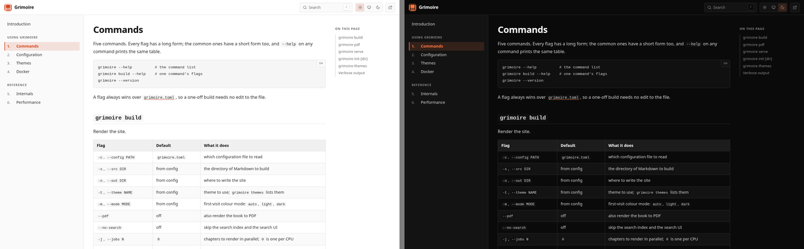
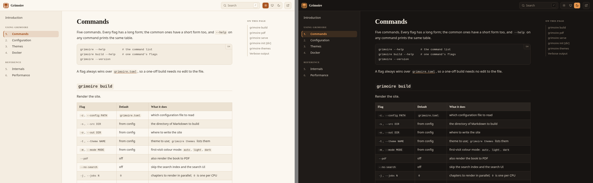
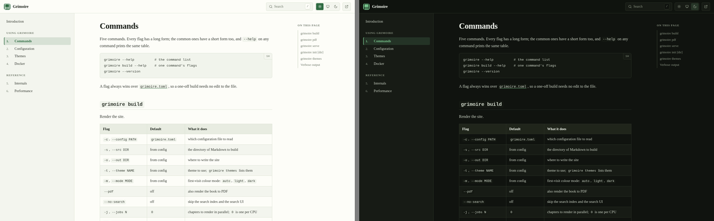
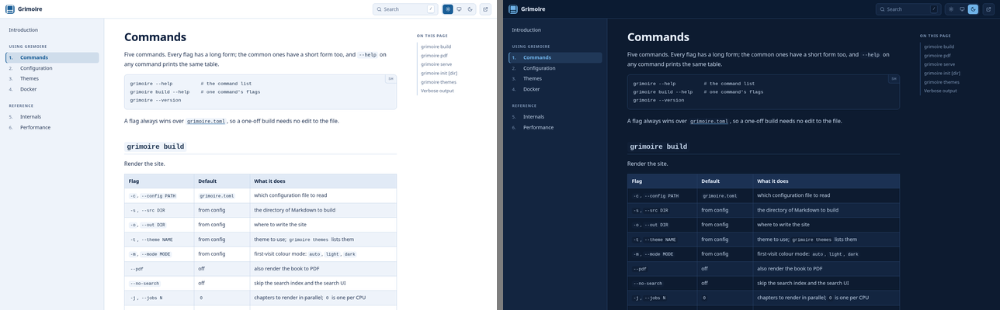
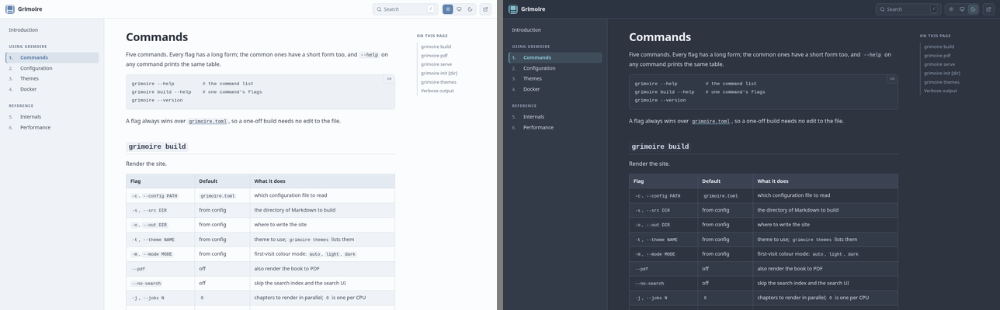
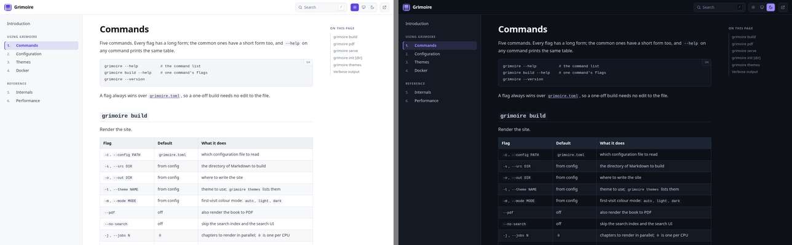
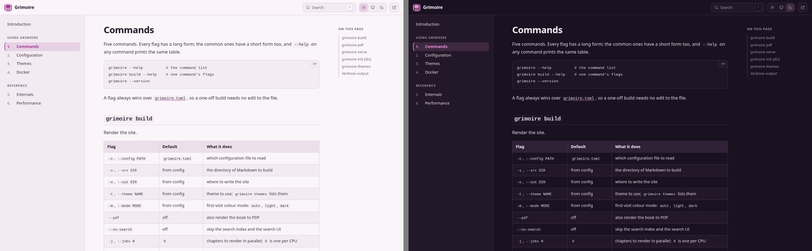
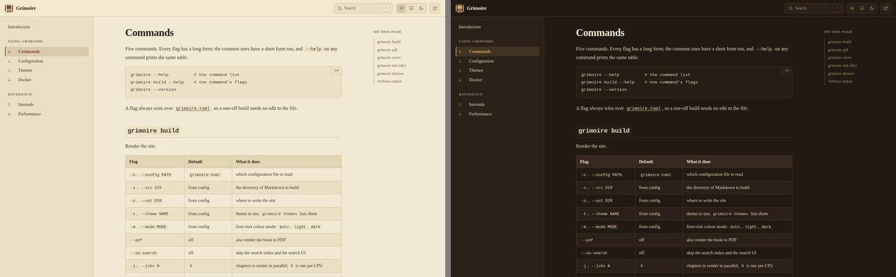
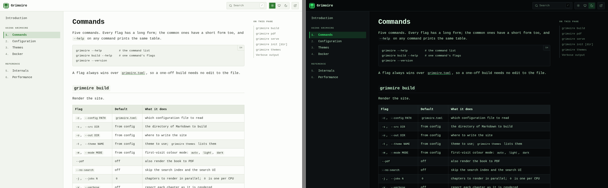

# Themes

Ten themes ship with Grimoire. Every one defines a **light and a dark palette** -
that is not optional in the theme model, so no theme can render a broken dark
mode - plus a type stack, a corner radius, and the measure of the text column.

```sh
grimoire themes                  # the list, with one line each
grimoire build --theme nordic    # try one without editing the config
```

```toml
[html]
theme = "nordic"
mode = "auto"     # what a first-time reader gets: auto | light | dark
```

Each screenshot below is the same page of this manual - the command reference,
light on the left and dark on the right - captured at 1440px wide, where the
three-column layout is showing. Regenerate them all with [`scripts/screenshots.sh`](#regenerating-the-gallery).

## The gallery

Alphabetically. `grimoire` is the default; the rest are equals.

### carbon

Graphite and teal, designed dark-first: the dark palette came first and the
light one is its inverse rather than the other way round. Built for long
technical reference.



### ember

High-contrast neutral with an orange accent, near-square corners, and the widest
measure at 860px - the most screen-native of the ten.



### grimoire

Warm parchment and ink with a rust accent, and the only theme with serif
headings over a sans body. The default.



### ivy

Cream paper and forest green, with a **serif body** and a narrow 700px measure.
The one to pick when the book is mostly prose.



### meridian

Deep navy ink on a white page, blue-tinted panels, a dark steel-blue accent, and
a navy dark mode. The product-handbook register: sober, corporate, unfussy.



### nordic

The Nord palette - arctic blue-greys, a frost-blue accent, and a dark mode that
is deliberately not black. Low glare and very even contrast, which suits reading
for an hour more than it suits a screenshot.



### obsidian

Cool slate with a violet accent, sans throughout. The dark mode is the one this
theme is really about.



### orchid

Mauve-tinted paper with a violet-pink accent, a plum dark mode, and the roundest
corners of the set. Friendly and light.



### sepia

Yellowed paper and deep coffee brown, full serif. The gentlest of the ten on a
bright screen, and the only one whose dark mode is dark *brown* - old leather
rather than the near-black the others use.



### terminal

Monospace everywhere, phosphor green on near-black, corners almost square. A
console in a browser.



## At a glance

| Theme | Body | Headings | Radius | Measure |
| ----- | ---- | -------- | -----: | ------: |
| `carbon` | sans | sans | 5px | 800px |
| `ember` | sans | sans | 3px | 860px |
| `grimoire` | sans | serif | 7px | 760px |
| `ivy` | serif | serif | 4px | 700px |
| `meridian` | sans | sans | 6px | 790px |
| `nordic` | sans | sans | 6px | 780px |
| `obsidian` | sans | sans | 6px | 780px |
| `orchid` | sans | sans | 8px | 770px |
| `sepia` | serif | serif | 5px | 700px |
| `terminal` | mono | mono | 2px | 820px |

## The PDF follows the theme

The printable book is themed too. Heading bars and the table header band are
drawn from the selected theme's **light** palette - paper is white, so the dark
palette would print as slabs of toner - with heading bars taking the accent mixed
toward white, deepest at level one. So `terminal` prints with green heading bars
and `sepia` with brown ones, and the hierarchy still reads at a glance.

## How a theme is built

A theme is one file under `src/themes/`, and it is almost entirely a colour
table. The layout rules live in a single constant stylesheet that only ever
reads `var(--gr-*)` custom properties, so a theme never restates a rule - it
supplies values.

```jennifer
export func theme() {
    return palette.Theme{
        name: "nordic",                       # the value for html.theme
        label: "Nordic",
        description: "Arctic blue-grey ...",  # the line `grimoire themes` prints
        light: palette.palette(...),          # fourteen colours
        dark: palette.palette(...),           # fourteen more
        fontBody: palette.sans(),
        fontHeading: palette.sans(),
        fontMono: palette.mono(),
        radius: 6,
        contentWidth: 780
    };
}
```

`contentWidth` is the only width a theme sets. The two beside it - the book
contents on one side, the page contents on the other - are not a matter of
taste, so they are fixed in `palette.j` for every theme, and they **grow with
the viewport**:

| | narrow | wide |
| - | -----: | ---: |
| book contents | 302px | up to 400px |
| on this page | 232px | up to 340px |

Both columns hold titles, and a title is as long as it is. At a fixed width the
only thing that gives is the line count, so a page with headings like
"Immutability, yanking, and deletion" wraps nearly every row and a list meant to
be scanned at a glance reads as a paragraph. Below about 1590px nothing has
changed - the old fixed widths are the floor - and above it the columns take
their share of the room a large screen has going spare.

The shell as a whole is still capped, at 1886px, which is both columns at their
widest plus the roomiest measure any theme asks for. Uncapped, the two columns
end up pinned to the far edges of a wide monitor with the text stranded in the
middle, and a contents list is only useful beside the thing it lists.

`palette.palette` is positional, taking the fourteen colours in the order the
`Palette` struct declares them, which keeps a theme file readable as a table:

| # | Field | What it paints |
| -: | ----- | -------------- |
| 1 | `bg` | the page background |
| 2 | `surface` | raised surfaces: sidebar, code blocks, cards |
| 3 | `surfaceAlt` | hover and zebra-stripe fills |
| 4 | `border` | hairline rules and outlines |
| 5 | `text` | body text |
| 6 | `muted` | secondary text: captions, breadcrumbs, metadata |
| 7 | `heading` | heading text |
| 8 | `accent` | links, the active chapter, focus rings |
| 9 | `accentHover` | the accent under a pointer |
| 10 | `onAccent` | text drawn on an accent fill |
| 11 | `codeText` | code text |
| 12 | `codeBg` | inline-code and code-block background |
| 13 | `selection` | the text-selection highlight |
| 14 | `shadow` | the shadow colour, including its alpha |

Any CSS colour notation works; the shipped themes use hex for opaque colours and
`rgba()` for `selection` and `shadow`.

Three font helpers - `palette.sans()`, `palette.serif()`, `palette.mono()` -
return stacks that each end in a generic family, so a machine with none of the
named faces still renders the intended shape. A theme is free to pass its own
stack string instead.

### Adding one

1. Copy an existing file in `src/themes/` and fill in the two palettes.
2. `import` it in `src/theme.j` and add `yours.theme()` to `all()`.

That is the whole registration. `grimoire themes`, the `--theme` flag, the
config validation, and the PDF colours all read from `all()`, so nothing else
needs to hear about it.

```sh
jennifer fmt --write src/themes/yours.j
bin/grimoire build --theme yours
```

## Regenerating the gallery

`scripts/screenshots.sh` rebuilds every image in `docs/screenshots/`:

```sh
scripts/screenshots.sh              # all ten
scripts/screenshots.sh nordic ivy   # just these
```

It needs `chromium`, ImageMagick, and a Jennifer interpreter on `PATH`
(override with `CHROMIUM`, `MAGICK`, `JENNIFER`). The book is built
**once**, because the HTML is identical for every theme - only
`assets/grimoire.css` differs, so the loop swaps the stylesheet with
`scripts/theme-css.j` rather than running ten builds. Each theme is then
captured twice, with the colour mode pinned in `localStorage` before the first
paint, and the pair is composited side by side.

`PAGE`, `SRC`, `OUT`, and the four size variables at the top of the script
override the defaults, so pointing the gallery at a different page or a
different book is a variable, not an edit:

```sh
PAGE=index.html SRC=docs OUT=/tmp/shots scripts/screenshots.sh grimoire
```
